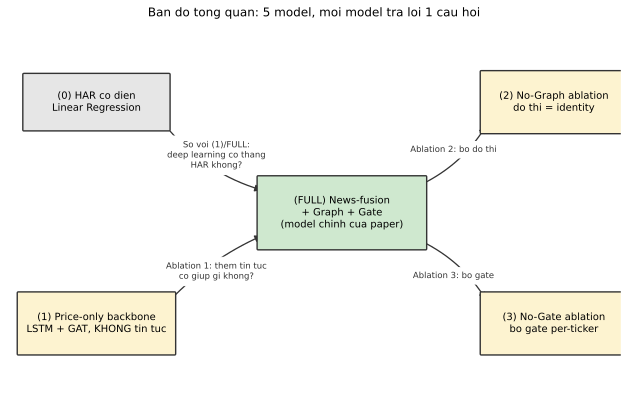
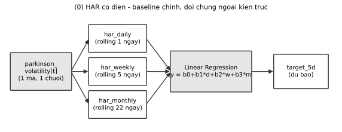
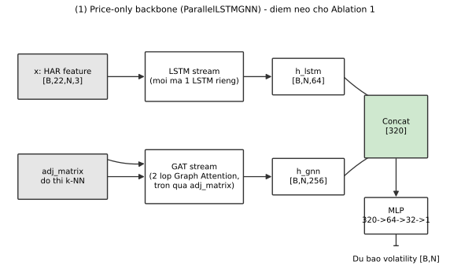
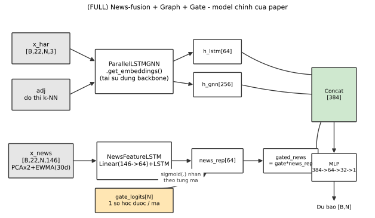
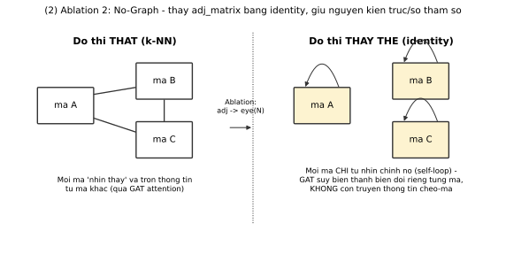
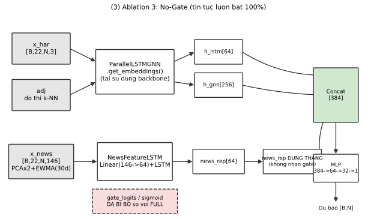

# Kiến trúc mô hình và lý do thiết kế thí nghiệm — tài liệu review

Tài liệu này vẽ lại toàn bộ các kiến trúc/biến thể xuất hiện trong
`docs/paper/soict2026_draft_v3.tex`, kèm lý do vì sao mỗi biến thể được đưa vào so sánh. Mục
đích: giúp review nhanh xem cách đóng khung thí nghiệm (baseline chính + 3 ablation) có hợp lý
không, trước khi chốt bản paper.

Nguồn code cho từng khối: `src/har_baseline/train.py`, `src/lstm_gat_hybrid/model_parallel.py`,
`baselines/2026-07-25_dual_group_news_embedding_baseline/code/model_dual_news.py`,
`baselines/2026-07-26_per_ticker_news_gate_baseline/code/model_per_ticker_gate.py`,
`scripts/ablation_no_graph/run_no_graph_ablation.py`.

---

## 0. Bản đồ tổng quan — 5 model, 1 câu hỏi mỗi model trả lời

**Lý do tổng thể (theo yêu cầu sửa 2026-08-05):** trước đây so sánh chính là FULL vs (1)
price-only backbone — nhưng (1) không phải là một "đối chứng" độc lập, nó CHÍNH LÀ FULL trừ đi
nhánh tin tức, tức là bản chất nó là 1 ablation, không phải baseline ngoài. Baseline ngoài đúng
nghĩa (kiến trúc hoàn toàn khác, đã được cộng đồng dùng làm chuẩn so sánh cho volatility
forecasting suốt 15+ năm — Corsi 2009) là **(0) HAR cổ điển**. Nên bảng so sánh chính của paper
giờ là (0) vs (FULL); còn (1), (2), (3) đều là ablation nằm trong nội bộ kiến trúc FULL.

---

## 1. (0) HAR cổ điển — baseline chính, đối chứng ngoài kiến trúc

**Lý do đưa vào:** đây là mô hình thống kê kinh điển (Corsi 2009, HAR-RV), KHÔNG dùng deep
learning, KHÔNG dùng tin tức, KHÔNG biết gì về mã khác — mỗi mã train/dự báo hoàn toàn độc lập.
Nếu FULL model không thắng nổi cái này, toàn bộ độ phức tạp thêm vào (LSTM, GAT, tin tức, gate)
không có giá trị thực tế. **Kết quả thật (2026-08-05, đã sửa bug split per-ticker):** HAR thắng
RMSE/MAE, FULL thắng QLIKE/R² — không phải FULL thắng tuyệt đối, đây là điểm paper trình bày
trung thực chứ không tô vẽ.

---

## 2. (1) Price-only backbone (`ParallelLSTMGNN`) — Ablation 1's "no-news" điểm neo

**Lý do đưa vào:** đây là "xương sống" (backbone) mà nhánh tin tức được gắn thêm vào. Dùng làm
điểm neo cho **Ablation 1** (§ paper 5.2, Bảng 2): so FULL (backbone + tin tức) với chính
backbone này (không tin tức) để đo riêng đóng góp của tin tức — đây là phép so sánh nội bộ kiến
trúc (giữ nguyên phần LSTM+GAT), khác với so với HAR (kiến trúc hoàn toàn khác).

---

## 3. (FULL) News-fusion + Graph + Gate — model chính của paper

**Lý do thiết kế gate per-ticker (không phải gate dùng chung):** mỗi mã có 1 tham số gate RIÊNG
(`gate_logits[i]`), nên `∂loss/∂gate_logits[i]` chỉ phụ thuộc đúng sai số dự báo của MÃ ĐÓ — khác
với thiết kế gate dùng chung (`gate_mlp`, đã thử ở baseline `2026-07-18_gated_crossattn_baseline`,
gradient của nó là tổng qua MỌI mã nên có thể học "đường tắt" theo ngành/nhóm thay vì mức độ hữu
ích tin tức thật của từng mã riêng lẻ). Ý tưởng: cho phép model tự học "mã nào nên tin tin tức
nhiều, mã nào ít" một cách độc lập từng mã.

**Kết quả thật cho quyết định thiết kế này (Ablation 3, §5.2 paper):** giả thuyết trên KHÔNG được
xác nhận — bỏ hẳn gate (luôn dùng 100% tin tức) cho kết quả nhỉnh hơn (không có ý nghĩa thống kê)
trên cả 6 metric. Cơ chế gate per-ticker không đo được lợi ích thêm so với phương án đơn giản hơn.

---

## 4. (2) Ablation 2 — No-Graph (đồ thị bị thay bằng identity)

**Lý do đưa vào:** GAT (đồ thị) được kỳ vọng giúp mô hình học quan hệ lan truyền biến động
(spillover) giữa các mã. Ablation này kiểm tra trực tiếp giả thuyết đó: nếu tắt hẳn khả năng
"nhìn mã khác" (nhưng vẫn giữ đúng số tham số, đúng kiến trúc GAT — chỉ đổi ma trận kề thành
identity), kết quả có tệ đi rõ rệt không? **Đã verify bằng test độc lập:** nhiễu input mã B/C
không làm thay đổi embedding của mã A khi dùng identity (Δ=0.0), nhưng THAY ĐỔI RÕ khi dùng đồ thị
thật (Δ=2.32) — xác nhận ablation thực sự tắt được cơ chế truyền thông tin, không phải lỗi wiring.

**Kết quả thật:** không có khác biệt có ý nghĩa thống kê trên cả 6 metric (3 seed, |t| < 1.9,
ngưỡng t=4.303). Đóng góp của nhánh GAT (nếu có) đến từ khả năng biến đổi riêng từng mã (tham số
học được), KHÔNG đến từ việc truyền thông tin chéo-mã qua đồ thị.

---

## 5. (3) Ablation 3 — No-Gate (tin tức luôn bật 100%, không có gate per-ticker)

**Lý do đưa vào:** đây chính là baseline `DualGroupNewsBaseline`
(`2026-07-25_dual_group_news_embedding_baseline`) — bản gốc TRƯỚC KHI thêm cơ chế gate per-ticker
(FULL = bản này + thêm đúng 1 thứ: gate). So sánh trực tiếp 2 model NÀY (kiến trúc giống hệt nhau
ngoại trừ có/không có gate) đo được chính xác đóng góp của RIÊNG cơ chế gate, tách biệt khỏi đóng
góp của bản thân feature tin tức (đã đo ở Ablation 1).

**Lưu ý quan trọng:** baseline gốc này dùng checkpoint CŨ (trước khi sửa bug P1.2 - lệch ngày
giữa các mã), nên phải train lại từ đầu trên pipeline đã sửa lỗi mới so sánh công bằng được — đã
làm (3 seed, cùng 20 epoch, cùng data với FULL).

**Kết quả thật:** no-gate nhỉnh hơn gate trên CẢ 6 metric tính theo mean (không có ý nghĩa thống
kê, |t| < 2.3). Cơ chế gate per-ticker không đo được lợi ích thêm — nếu giữ, nên giữ vì lý do diễn
giải được (interpretability: biết mã nào "dùng" tin tức nhiều), không phải vì lý do hiệu năng.

---

## 6. Bảng số liệu đầy đủ — cả 6 metric, cả 5 model, số liệu thật (không làm tròn khác nguồn)

Nguồn: `results/har_baseline_2026-08-05_224208/test_metrics.csv`,
`results/parallel_lstm_gnn_knn_{2026-08-03_230722,seed123_2026-08-03_234613,seed2026_2026-08-04_000327}/training_results.json`,
`results/per_ticker_gate_{2026-08-03_230821,2026-08-04_000448,2026-08-04_002252}/results.json`,
`results/no_graph_ablation_seed{42_2026-08-05_225806,123_2026-08-05_231327,2026_2026-08-05_232845}/training_results.json`,
`results/dual_group_news_2026-08-05_{230040,231746,233438}/results.json`. n_seed=1 cho HAR (mô hình
tuyến tính đóng, không có nguồn ngẫu nhiên — không cần multi-seed); n_seed=3 (42/123/2026, 20
epoch/seed) cho 4 model deep learning còn lại.

| Model | n_seed | MSE ↓ | RMSE ↓ | MAE ↓ | R² ↑ | QLIKE ↓ | DirAcc ↑ (%) |
|---|---|---|---|---|---|---|---|
| (0) HAR cổ điển | 1 | 4.76e-06 | 0.002182 | 0.000575 | 0.7419 | 0.5493 | 48.65 |
| (1) Price-only backbone | 3 | 8.55e-06±5.32e-07 | 0.002923±0.000090 | 0.000811±0.000014 | 0.7749±0.0140 | 0.4603±0.0205 | 48.47±0.35 |
| (FULL) News+Graph+Gate | 3 | 7.48e-06±5.28e-07 | 0.002734±0.000096 | 0.000793±0.000012 | 0.8031±0.0139 | 0.4430±0.0185 | 47.77±0.52 |
| (2) Ablation — No-Graph | 3 | 7.78e-06±3.22e-07 | 0.002788±0.000058 | 0.000788±0.000011 | 0.7953±0.0085 | 0.4657±0.0112 | 48.29±0.04 |
| (3) Ablation — No-Gate | 3 | 7.42e-06±4.02e-07 | 0.002723±0.000074 | 0.000787±0.000010 | 0.8047±0.0106 | 0.4366±0.0116 | 48.22±0.27 |

**Đọc bảng theo từng cột (model nào tốt nhất mỗi metric):**
- **MSE/RMSE/MAE (càng thấp càng tốt):** (0) HAR thấp nhất tuyệt đối (RMSE 0.002182) — thấp hơn
  cả 4 model deep learning. Trong 4 model deep learning, (3) No-Gate thấp nhất (RMSE 0.002723).
- **R²/QLIKE (R² càng cao, QLIKE càng thấp càng tốt):** (3) No-Gate tốt nhất cả 2 metric này
  (R²=0.8047, QLIKE=0.4366), nhỉnh hơn cả (FULL). (0) HAR kém nhất QLIKE (0.5493) dù RMSE/MAE lại
  tốt nhất — đây chính là lý do 2 nhóm metric "kể câu chuyện khác nhau" (xem giải thích bên dưới).
- **DirAcc (càng cao càng tốt):** tất cả 5 model đều quanh 48%, gần mức random (50%) — không model
  nào vượt trội, đúng như phân tích ở `docs/reports/2026-08-04_diracc_low_accuracy_analysis.md`
  (nguyên nhân cấu trúc, không phải model kém).

**Vì sao RMSE/MAE và QLIKE/R² không đồng thuận (HAR thắng nhóm 1, thua nhóm 2)?** RMSE/MAE phạt
sai số tuyệt đối như nhau ở mọi mức volatility; QLIKE phạt NẶNG HƠN khi model dự báo THẤP hơn thực
tế lúc volatility thực sự cao (bất đối xứng, chuẩn học thuật cho volatility forecasting — Patton
2011). HAR (mô hình tuyến tính đơn giản) có RMSE thấp vì dự báo "mượt", ít lệch trung bình, nhưng
kém hơn ở đúng những thời điểm volatility tăng đột biến (nơi QLIKE phạt nặng) — các model deep
learning (đặc biệt có tin tức) bắt được biến động đột biến này tốt hơn, nên QLIKE/R² tốt hơn dù
RMSE/MAE trung bình không thắng. Đây là phát hiện thật, không phải diễn giải để né tránh — paper
v3 trình bày đúng cả 2 chiều, không chọn 1 chiều có lợi để báo cáo.

---

## 7. Kết luận tổng hợp — vì sao paper đổi claim chính (bản v3)

| Thành phần bị ablate | Có đóng góp đo được không? | Ý nghĩa thống kê? |
|---|---|---|
| Nhánh tin tức (Ablation 1: FULL vs backbone) | **Có** — QLIKE/RMSE cải thiện | Có (paired t, n=3, \|t\|=6.22 và 9.38) |
| Đồ thị chéo-mã (Ablation 2: đồ thị thật vs identity) | Không | Không (\|t\| < 1.9) |
| Gate per-ticker (Ablation 3: gate vs no-gate) | Không (no-gate nhỉnh hơn) | Không (\|t\| < 2.3) |

**Logic dẫn tới claim mới của paper:** trong 3 cơ chế được thiết kế thêm vào (tin tức, đồ thị,
gate), chỉ có tin tức là có đóng góp đo được có ý nghĩa thống kê. Đồ thị và gate — 2 cơ chế được
kỳ vọng làm cho việc dùng tin tức "thông minh hơn" — đều KHÔNG đo được lợi ích thêm. Đây là lập
luận ủng hộ **parsimony** (đơn giản hóa kiến trúc): một model LSTM + concat tin tức đơn giản hơn
cho kết quả không khác biệt có ý nghĩa so với kiến trúc đầy đủ phức tạp hơn — và claim chính của
paper (v3) phản ánh đúng phát hiện này thay vì giữ claim cũ ("kiến trúc gated-graph của chúng tôi
thắng") vốn không được 2 ablation mới ủng hộ.

**Giới hạn cần nêu khi review:** n=3 seed cho mỗi ablation — đủ để tính paired t-test nhưng là cỡ
mẫu tối thiểu, không chứng minh "tương đương", chỉ cho biết chưa đo được khác biệt ở mức ý nghĩa
5%. Ablation 2 và 3 được làm RIÊNG LẺ (bỏ từng cái một), chưa test bỏ CẢ HAI cùng lúc.
