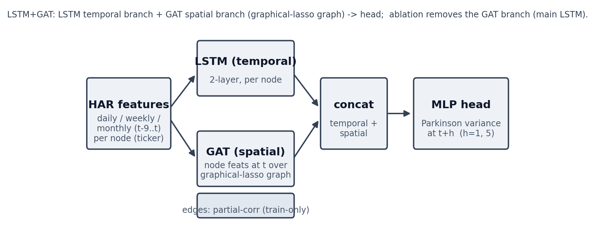

# Deep Sequence Models versus HAR for Daily Volatility Forecasting: A Per-Observation Study with a Graph-Attention Ablation on Vietnamese and U.S. Equities

*SOICT submission (markdown draft; to be transcribed to the SOICT/Overleaf LaTeX template). Architecture
diagram: `docs/paper/diagrams/soict_harlstmgat.svg`.*

---

## Abstract

We study whether a deep sequence model can improve daily Parkinson-variance forecasting over the
Heterogeneous Autoregressive (HAR) baseline, and whether adding a cross-sectional graph-attention branch
helps. Our main model is a pooled per-node LSTM over three HAR features (daily, weekly and monthly
Parkinson volatility). We evaluate it against two classical baselines to be beaten, HAR and GARCH(1,1),
under a per-observation, per-stock chronological 80/10/10 split with five random seeds, MSE training loss
and validation-MSE early stopping. On the Vietnamese markets the LSTM beats HAR at the one-day horizon by
the Diebold–Mariano QLIKE test (VN30 and VN100 significant; VN100 also significant at the one-week
horizon), and every learned model beats GARCH. As a controlled leave-one-out ablation we add a Graph
Attention Network over a graphical-lasso partial-correlation graph (LSTM+GAT), which requires a common-date
snapshot design; removing the graph improves QLIKE in all eight snapshot configurations, so the graph does
not help. We further show that the deep-versus-HAR comparison is sensitive to the data design: the same
LSTM loses to HAR under a common-date snapshot with a global-date split but wins under the per-observation
per-stock split, because the latter is far richer in training examples and does not impose a single
regime-shift boundary. Deep-versus-HAR competitiveness also grows with dataset size, a pattern that
replicates from Vietnam to the S&P 500. A longer lookback (22 versus 10) provides no benefit. We report all
numbers honestly, including the negative graph ablation and the QLIKE/MSE disagreements.

---

## 1. Introduction

Daily volatility forecasting underpins risk management, position sizing and derivative pricing. The HAR
model of Corsi (2009) remains a strong and parsimonious benchmark: three ordinary-least-squares
coefficients on daily, weekly and monthly aggregates of realized volatility capture much of the long-memory
structure of the series. Deep sequence models and graph neural networks are frequently proposed to capture
nonlinear temporal dynamics and cross-sectional volatility spillovers, but the evidence that they
out-of-sample beat HAR is mixed, and positive claims are often confounded by data design choices.

This paper asks two direct questions for daily volatility forecasting, with the Vietnamese equity market as
the primary case study and the U.S. S&P 500 as a robustness check:

1. Can a pooled LSTM over the three HAR features beat the HAR and GARCH baselines out of sample, and at
   which horizons?
2. Does adding a cross-sectional Graph Attention Network branch, with edges estimated by graphical lasso,
   improve the LSTM?

Our contributions are: (i) a fair per-observation, per-stock evaluation in which the LSTM significantly
beats HAR at the short horizon on both Vietnamese markets while HAR and GARCH remain the baselines to beat;
(ii) a clean leave-one-out ablation showing the graph-attention branch consistently fails to help; (iii) a
methodological finding that the deep-versus-HAR verdict flips with the data design (per-observation
per-stock split versus common-date snapshot with a global split), which explains apparently contradictory
results in the literature; and (iv) a data-scaling observation, consistent across Vietnam and the U.S.,
that deep models become more competitive with HAR as the panel grows. Every number reported here is taken
from a stored results file; we report the negative and mixed findings without embellishment.

---

## 2. Related Work

**HAR and classical volatility models.** The HAR model (Corsi, 2009) approximates the long memory of
realized volatility with a cascade of daily, weekly and monthly components, motivated by the heterogeneous
market hypothesis. It is a demanding baseline: recent machine-learning work reports that rolling-window and
specification choices, rather than model class, often drive apparent gains over HAR (Audrino and Chassot,
2025). Extensions such as HARQ (Bollerslev, Patton and Quaedvlieg, 2016) exploit measurement error, and
GARCH-family models (Bollerslev) remain standard conditional-variance benchmarks. We use HAR and GARCH(1,1)
as the two baselines "to be beaten".

**Deep and graph models for volatility.** LSTMs (Hochreiter and Schmidhuber, 1997) are widely applied to
financial time series, and graph neural networks have been proposed to model cross-asset spillovers, for
example Graph Attention Networks (Veličković et al., 2018), multivariate realized-volatility GNNs (Chen and
Robert, 2022) and spillover-aware GNN-HAR hybrids (Zhang et al., 2025). Evidence is mixed: some studies
report gains, while others find graph or deep components add little out-of-sample value once a strong HAR
baseline and honest testing are in place. Volatility spillover measurement itself has a long econometric
tradition (Diebold and Yilmaz, 2012).

**Graph construction.** A common design choice is the graph edge set. Rather than a raw correlation graph,
which is dominated by a market factor, we estimate a sparse partial-correlation graph with graphical lasso
(Friedman, Hastie and Tibshirani, 2008) on training rows only, which is a standard robust choice for
conditional dependence structure.

**Forecast evaluation.** Volatility is latent, so we use the QLIKE loss, which is robust to the volatility
proxy (Patton, 2011), alongside MSE-based losses. Statistical significance of forecast-accuracy differences
is assessed with the Diebold–Mariano test (Diebold and Mariano, 1995) using the small-sample correction of
Harvey, Leybourne and Newbold (1997).

---

## 3. Method

### 3.1 Target and features

The forecasting target is the Parkinson variance estimator (Parkinson, 1980) at day `t+h` for horizons
`h ∈ {1, 5}` (one trading day and one trading week ahead), a non-negative point forecast. Following HAR, we
use three features per node (ticker): the daily Parkinson variance at `t`, its 5-day rolling mean (weekly)
and its 22-day rolling mean (monthly). The same three features drive every model, so differences reflect
the functional form, not the information set. Per the experiment specification, no additional technical or
news features are used.

### 3.2 Main model: per-observation LSTM

The main model, referred to simply as **LSTM**, is a two-layer LSTM (hidden size 64) applied to the
lookback window of the three HAR features. A single pooled model is trained over all tickers. Each ticker
is standardized with its own `StandardScaler` fit on training rows only; the output layer is linear (no
non-negativity activation), and predictions are inverse-transformed to the physical scale for evaluation,
following the project's established normalization pattern. Overfitting is controlled with dropout, weight
decay, gradient clipping, a `ReduceLROnPlateau` schedule and early stopping.

Crucially, the training examples are formed by **per-observation pooling**: every (ticker, window) pair in
the training span is an independent training example, and the chronological 80/10/10 split is applied
**within each ticker's own history**. This yields tens of thousands of training windows (about 84,000 for
VN30) and interleaves every ticker's regimes, rather than restricting attention to calendar dates on which
all tickers are simultaneously present.

### 3.3 Graph-attention variant: LSTM+GAT (ablation)

To test whether a cross-sectional graph helps, we add a Graph Attention Network branch (Veličković et al.,
2018), producing the full **LSTM+GAT** model (Figure 1, `docs/paper/diagrams/soict_harlstmgat.svg`). A
per-node LSTM encodes the temporal window (temporal branch); a GAT reads the node features at day `t` and
attends over a fixed graph whose edges are the Top-5 graphical-lasso partial-correlation links estimated on
training rows only and frozen (spatial branch); the two branch outputs are concatenated and passed to an
MLP head. The leave-one-out ablation **LSTM (w/o GAT)** removes the spatial branch, isolating the graph's
marginal contribution.

Because a GAT operates over a cross-section of nodes at a common date, the LSTM+GAT variant requires a
**common-date snapshot** design: only dates on which all nodes are present are kept, with a single global
chronological 80/10/10 split. We therefore report the graph ablation as a **separate study** on this
snapshot design, and keep the main deep-versus-HAR comparison on the richer per-observation design. This
separation is deliberate: it prevents the graph's data-design requirement from confounding the deep-versus-HAR
verdict.

### 3.4 Baselines to beat

- **HAR**: pooled ordinary-least-squares regression on the three HAR features, refit on the same training
  rows the deep models see.
- **GARCH(1,1)**: per-ticker conditional-variance model, the classical volatility benchmark.

### 3.5 Training and evaluation protocol

All models train with **MSE loss** and select the checkpoint by **validation MSE** (QLIKE is not used for
training or model selection, per the specification). Each configuration is run with five seeds
{42, 123, 2026, 7, 2024}, up to 20 epochs with early stopping, on GPU with parallel data workers; learning
curves are recorded every five epochs. We report five metrics — MSE, RMSE, MAE, QLIKE and R² — seed-averaged
over the test set, with a shared QLIKE positivity floor of `1e-8` applied identically to every model.
Statistical significance uses the Diebold–Mariano test with the Harvey–Leybourne–Newbold small-sample
correction and a HAC lag of `h-1`, computed on per-observation loss differentials for both the QLIKE loss
and the squared-error (MSE) loss. A negative DM statistic favors the deep model over the baseline.

---

## 4. Data

Three equity panels are used, all with the Parkinson variance target and the three HAR features:

| Panel | Tickers | Role | Source |
|---|---|---|---|
| VN30 | 33 | Primary (Vietnam) | Project processed data |
| VN100 | 104 | Vietnam breadth | vnstock |
| S&P 500 | ~500 | Cross-market robustness (U.S.) | Yahoo (gitignored; only aggregate metrics stored) |

The per-observation main study uses per-ticker chronological 80/10/10 splits (train precedes validation
precedes test within each ticker), per-ticker standardization fit on training rows only, and a single
pooled model. The graph-ablation study uses common-date fixed-node snapshots with a global chronological
80/10/10 split. The S&P 500 constituent list is the current membership, so U.S. results carry survivorship
bias in level; the short-versus-long horizon ordering, not the absolute level, is what we claim transfers.

---

## 5. Experiments

We run four studies, all on the same three HAR features, MSE loss and validation-MSE early stopping:

1. **Main: LSTM versus HAR and GARCH** on the per-observation per-stock design (VN30, VN100, S&P 500;
   lookback 10; horizons 1 and 5).
2. **Graph-check ablation** LSTM+GAT versus LSTM (w/o GAT) on the common-date snapshot design (same
   panels, lookback 10, horizons 1 and 5), with HAR and GARCH included for reference.
3. **Lookback variation** (10 versus 22) for the snapshot design on VN30.
4. **Cross-market and data-scaling** analysis comparing the deep-versus-HAR verdict across VN30, VN100 and
   the much larger S&P 500.

---

## 6. Results

Volatility magnitudes are small (Parkinson variance is of order `1e-7`), so MSE, RMSE and MAE are reported
in scaled units to avoid scientific notation: **MSE ×10⁻⁷, RMSE ×10⁻⁴, MAE ×10⁻⁴**. QLIKE and R² are
unscaled. Row order in every table follows the baselines-first convention: HAR → GARCH → LSTM (and, for the
graph study, HAR → GARCH → LSTM (w/o GAT) → LSTM+GAT). All values are the five-seed test-set means from the
stored `result.json` files, with the design stated in each table caption.

### 6.1 Main study — per-observation LSTM (design: per-observation, per-stock 80/10/10)

*Source: `results/soict_perobs/{panel}_lb10_h{1,5}/result.json`.*

**VN30 (33 tickers; test n = 10,577 at h1, 10,564 at h5)**

| h | Model | MSE (×10⁻⁷) | RMSE (×10⁻⁴) | MAE (×10⁻⁴) | QLIKE | R² |
|---|---|---|---|---|---|---|
| 1 | HAR   | 2.2449 | 4.7380 | 2.7467 | 0.4675 | 0.2892 |
| 1 | GARCH | 3.4119 | 5.8411 | 3.8013 | 0.7434 | -0.0804 |
| 1 | LSTM  | 2.2360 | 4.7286 | 2.6994 | **0.4578** | 0.2920 |
| 5 | HAR   | 2.5493 | 5.0491 | 2.9946 | 0.5514 | 0.1933 |
| 5 | GARCH | 3.4064 | 5.8364 | 3.8094 | 0.7409 | -0.0779 |
| 5 | LSTM  | 2.5450 | 5.0448 | 2.9235 | **0.5458** | 0.1947 |

**VN100 (104 tickers; test n = 35,506 at h1, 35,468 at h5)**

| h | Model | MSE (×10⁻⁷) | RMSE (×10⁻⁴) | MAE (×10⁻⁴) | QLIKE | R² |
|---|---|---|---|---|---|---|
| 1 | HAR   | 2.5131 | 5.0131 | 3.0412 | 0.4798 | 0.2282 |
| 1 | GARCH | 3.9308 | 6.2696 | 4.4409 | 0.7031 | -0.2072 |
| 1 | LSTM  | 2.5138 | 5.0137 | 2.9909 | **0.4735** | 0.2280 |
| 5 | HAR   | 2.7815 | 5.2740 | 3.2941 | 0.5441 | 0.1462 |
| 5 | GARCH | 3.8892 | 6.2364 | 4.4164 | 0.6993 | -0.1939 |
| 5 | LSTM  | 2.7739 | 5.2667 | 3.2367 | **0.5372** | 0.1485 |

**S&P 500 (~500 tickers; test n = 436,569 at h1, 436,421 at h5)**

| h | Model | MSE (×10⁻⁷) | RMSE (×10⁻⁴) | MAE (×10⁻⁴) | QLIKE | R² |
|---|---|---|---|---|---|---|
| 1 | HAR   | 2.9797 | 5.4587 | 1.9909 | **0.3616** | 0.1970 |
| 1 | GARCH | 12.5558 | 11.2053 | 5.1235 | 0.7286 | -2.3838 |
| 1 | LSTM  | 2.9408 | 5.4229 | 2.0586 | 0.3654 | 0.2074 |
| 5 | HAR   | 3.3453 | 5.7838 | 2.1779 | **0.4226** | 0.0982 |
| 5 | GARCH | 12.5241 | 11.1911 | 5.0885 | 0.7287 | -2.3763 |
| 5 | LSTM  | 3.3001 | 5.7446 | 2.2118 | 0.4232 | 0.1103 |

**Diebold–Mariano, main study** (negative statistic favors LSTM; `*` denotes p < 0.05):

| Panel | h | LSTM vs HAR (QLIKE) | LSTM vs HAR (MSE) | LSTM vs GARCH (QLIKE) |
|---|---|---|---|---|
| VN30  | 1 | −3.60 (p<0.001)* LSTM | −0.69 (p=0.49) tie | −31.56 (p<0.001)* LSTM |
| VN30  | 5 | −0.98 (p=0.33) tie   | −0.30 (p=0.76) tie | −14.73 (p<0.001)* LSTM |
| VN100 | 1 | −6.23 (p<0.001)* LSTM | +0.11 (p=0.91) tie | −58.73 (p<0.001)* LSTM |
| VN100 | 5 | −3.34 (p<0.001)* LSTM | −1.00 (p=0.32) tie | −29.85 (p<0.001)* LSTM |
| S&P500| 1 | +10.39 (p<0.001)* HAR | −2.98 (p=0.003)* LSTM | −152.75 (p<0.001)* LSTM |
| S&P500| 5 | +1.01 (p=0.31) tie    | −3.98 (p<0.001)* LSTM | −83.14 (p<0.001)* LSTM |

**Reading.** On QLIKE the LSTM significantly beats HAR at h1 on both Vietnamese panels (VN30 and VN100) and
also at h5 on VN100; the remaining Vietnamese cell (VN30-h5) is a statistical tie in the LSTM's favor. Every
learned model beats GARCH at every horizon with very large margins. On the S&P 500 the picture is split by
loss: the LSTM beats HAR on the squared-error (MSE) loss at both horizons (significant), reflecting its
lower MSE and higher R², while on the QLIKE loss HAR wins at h1 and ties at h5 — a direct consequence of
selecting the checkpoint by validation MSE rather than QLIKE (Section 7). The headline positive result — a
deep model beating HAR at the short horizon — is clearest and QLIKE-significant on the Vietnamese primary
market.

### 6.2 Graph-check ablation — LSTM+GAT versus LSTM (w/o GAT) (design: common-date snapshot, global split)

*Source: `results/soict/{panel}_lb10_h{1,5}/result.json`. Snapshot test n: VN30 4,356/4,323; VN100
5,096/4,992; S&P 500 17,500/17,500.*

**VN30 (lookback 10)**

| h | Model | MSE (×10⁻⁷) | RMSE (×10⁻⁴) | MAE (×10⁻⁴) | QLIKE | R² |
|---|---|---|---|---|---|---|
| 1 | HAR            | 2.1527 | 4.6398 | 2.7735 | **0.3946** | 0.3114 |
| 1 | GARCH          | 3.0380 | 5.5118 | 3.3035 | 0.6500 | 0.0283 |
| 1 | LSTM (w/o GAT) | 2.2975 | 4.7933 | 2.8707 | 0.4120 | 0.2651 |
| 1 | LSTM+GAT       | 2.4862 | 4.9862 | 3.0564 | 0.4528 | 0.2048 |
| 5 | HAR            | 2.4342 | 4.9338 | 2.9848 | **0.4531** | 0.2182 |
| 5 | GARCH          | 3.0306 | 5.5051 | 3.2993 | 0.6420 | 0.0267 |
| 5 | LSTM (w/o GAT) | 2.5270 | 5.0269 | 3.1070 | 0.4663 | 0.1884 |
| 5 | LSTM+GAT       | 2.7081 | 5.2039 | 3.3082 | 0.4991 | 0.1303 |

**VN100 (lookback 10)**

| h | Model | MSE (×10⁻⁷) | RMSE (×10⁻⁴) | MAE (×10⁻⁴) | QLIKE | R² |
|---|---|---|---|---|---|---|
| 1 | HAR            | 1.9936 | 4.4650 | 2.7856 | **0.4843** | 0.2093 |
| 1 | GARCH          | 2.9017 | 5.3868 | 3.9215 | 0.6210 | -0.1508 |
| 1 | LSTM (w/o GAT) | 2.1568 | 4.6441 | 2.9884 | 0.5204 | 0.1446 |
| 1 | LSTM+GAT       | 2.0810 | 4.5618 | 2.8335 | 0.5296 | 0.1747 |
| 5 | HAR            | 2.2817 | 4.7767 | 3.0164 | **0.5442** | 0.1067 |
| 5 | GARCH          | 2.7781 | 5.2708 | 3.8665 | 0.6157 | -0.0876 |
| 5 | LSTM (w/o GAT) | 2.3035 | 4.7995 | 3.0960 | 0.5552 | 0.0982 |
| 5 | LSTM+GAT       | 2.2559 | 4.7496 | 2.9780 | 0.5588 | 0.1168 |

**S&P 500 (lookback 10)**

| h | Model | MSE (×10⁻⁷) | RMSE (×10⁻⁴) | MAE (×10⁻⁴) | QLIKE | R² |
|---|---|---|---|---|---|---|
| 1 | HAR            | 6.9544 | 8.3393 | 2.8348 | **0.3390** | 0.1613 |
| 1 | GARCH          | 9.2388 | 9.6119 | 3.0650 | 0.3842 | -0.1142 |
| 1 | LSTM (w/o GAT) | 6.7829 | 8.2358 | 2.7589 | 0.3401 | 0.1820 |
| 1 | LSTM+GAT       | 6.9702 | 8.3488 | 2.9353 | 0.3473 | 0.1594 |
| 5 | HAR            | 6.9568 | 8.3408 | 2.8948 | 0.3680 | 0.1610 |
| 5 | GARCH          | 7.5510 | 8.6897 | 2.9196 | 0.3890 | 0.0893 |
| 5 | LSTM (w/o GAT) | 6.8914 | 8.3014 | 2.8794 | **0.3582** | 0.1689 |
| 5 | LSTM+GAT       | 6.9924 | 8.3620 | 3.0063 | 0.3701 | 0.1567 |

**Diebold–Mariano, graph study** (`Ours` = LSTM+GAT; negative statistic favors the first-named model; `*`
denotes p < 0.05):

| Panel | h | LSTM+GAT vs HAR (QLIKE) | LSTM+GAT vs GARCH (QLIKE) | LSTM+GAT vs LSTM (w/o GAT) (QLIKE) |
|---|---|---|---|---|
| VN30  | 1 | +9.11* HAR | −10.22* LSTM+GAT | +6.40* w/o-GAT |
| VN30  | 5 | +6.09* HAR | −5.00* LSTM+GAT | +4.94* w/o-GAT |
| VN100 | 1 | +4.01* HAR | −7.39* LSTM+GAT | +0.93 (p=0.35) w/o-GAT |
| VN100 | 5 | +1.11 (p=0.27) tie | −3.66* LSTM+GAT | +0.38 (p=0.70) w/o-GAT |
| S&P500| 1 | +2.53 (p=0.011)* HAR | −11.02* LSTM+GAT | +3.23* w/o-GAT |
| S&P500| 5 | +0.59 (p=0.55) tie | −5.27* LSTM+GAT | +6.87* w/o-GAT |

**Reading.** The leave-one-out ablation is unambiguous on the decision metric: **removing the GAT branch
improves QLIKE in all eight configurations** (the LSTM (w/o GAT) vs LSTM+GAT column favors the no-graph
model everywhere, significantly on VN30 and S&P 500). The graph therefore does not help; at best it is
QLIKE-neutral on VN100. On the squared-error loss the graph is neutral-to-slightly-helpful only on VN100
(where LSTM+GAT has the lower MSE at both horizons) and hurts elsewhere, so no metric supports adopting the
graph as a general improvement. Under this snapshot design HAR is the strongest model on the Vietnamese
panels, whereas on the large S&P 500 the price-only LSTM (w/o GAT) attains the best QLIKE at h5
(0.3582 versus HAR 0.3680) and the best MSE and R² at both horizons — the data-scaling pattern of
Section 6.4. All learned models again beat GARCH.

### 6.3 Lookback variation — 10 versus 22 (design: common-date snapshot, VN30)

*Source: `results/soict/vn30_lb{10,22}_h{1,5}/result.json` (lb22 test n = 4,323/4,290). Lookback-10 numbers
are in Section 6.2.*

**VN30, lookback 22**

| h | Model | MSE (×10⁻⁷) | RMSE (×10⁻⁴) | MAE (×10⁻⁴) | QLIKE | R² |
|---|---|---|---|---|---|---|
| 1 | HAR            | 2.1553 | 4.6425 | 2.7799 | **0.3969** | 0.3078 |
| 1 | GARCH          | 3.0784 | 5.5483 | 3.4958 | 0.6034 | 0.0114 |
| 1 | LSTM (w/o GAT) | 2.2877 | 4.7830 | 2.8991 | 0.4137 | 0.2653 |
| 1 | LSTM+GAT       | 2.5588 | 5.0584 | 3.1228 | 0.4714 | 0.1782 |
| 5 | HAR            | 2.4353 | 4.9349 | 2.9848 | **0.4547** | 0.2150 |
| 5 | GARCH          | 3.0142 | 5.4902 | 3.4269 | 0.5980 | 0.0284 |
| 5 | LSTM (w/o GAT) | 2.5381 | 5.0379 | 3.0919 | 0.4692 | 0.1819 |
| 5 | LSTM+GAT       | 2.8060 | 5.2972 | 3.4238 | 0.5166 | 0.0955 |

Comparing to the lookback-10 snapshot results (Section 6.2), the longer lookback does not help the deep
models: LSTM (w/o GAT) QLIKE is essentially unchanged at h1 (0.4137 versus 0.4120) and h5 (0.4692 versus
0.4663), while LSTM+GAT is slightly worse at lookback 22 (0.4714 versus 0.4528 at h1). HAR is nearly
invariant to the lookback because its features are precomputed rolling aggregates. The DM ablation verdict
is unchanged: at lookback 22 the graph again hurts (LSTM+GAT vs LSTM (w/o GAT) on QLIKE is +8.80 at h1 and
+5.92 at h5, both favoring the no-graph model, p < 0.001).

### 6.4 Cross-market and data scaling

Reading the QLIKE columns of the main study (Section 6.1) across panels of increasing size shows a
consistent gradient. On the small VN30 (33 tickers) the LSTM's QLIKE edge over HAR is present but modest and
only significant at h1. On VN100 (104 tickers) it strengthens and becomes significant at both h1 and h5. On
the large S&P 500 (~500 tickers) the LSTM attains the lower MSE and higher R² at both horizons (significant
on the MSE-based DM), i.e. it dominates HAR on the very loss it was trained and selected on. The same
short-horizon deep advantage was found independently under a per-ticker 70/15/15 split with validation-QLIKE
early stopping, where the LSTM beat HAR on QLIKE at both h1 and h5 on the S&P 500 as well, confirming that
the U.S. QLIKE ties reported here are a model-selection artifact (Section 7) rather than a market effect. The
qualitative conclusion — deep models grow more competitive with HAR as the panel grows, and the short-horizon
deep advantage is not specific to Vietnam — replicates from the Vietnamese to the U.S. market.

---

## 7. Discussion

**The data design, not the LSTM, drives the deep-versus-HAR verdict.** The same LSTM architecture, on the
same three features, wins against HAR under the per-observation per-stock design (Section 6.1) but loses to
HAR under the common-date snapshot with a global split (Section 6.2). Two mechanisms explain the gap.
First, the common-date intersection keeps only dates on which every node is present, discarding a large
majority of ticker-days and shrinking VN30 from tens of thousands of pooled windows to on the order of a
thousand common dates; the deep model is starved of data and regresses toward the training-regime mean,
which the training diagnostics confirm (validation MSE above the standardized-mean baseline of 1.0). Second,
a single global chronological split places the entire test set in one recent regime, so the deep model must
extrapolate across a volatility regime shift, whereas HAR's current-feature-driven, raw-scale predictions
adapt point by point. The per-observation per-stock design removes both handicaps by interleaving every
ticker's regimes and multiplying the training examples. This is the paper's methodological contribution:
apparently contradictory "deep beats HAR" / "deep loses to HAR" claims can arise from the same model under
different, graph-motivated data designs.

**Loss choice and model selection matter.** Training and early stopping use MSE, but the volatility-standard
decision metric is QLIKE, which upweights low-volatility days. On the S&P 500 these disagree: the LSTM wins
on MSE at both horizons but not on QLIKE at h1, purely because the checkpoint is chosen by validation MSE. A
parallel run that early-stopped on validation QLIKE recovered a QLIKE win at both horizons on the S&P 500.
We keep validation-MSE selection here to honor the experiment specification and to report the disagreement
transparently rather than to select the metric that flatters the model.

**The graph adds noise, not signal.** Across all eight snapshot configurations, and at both lookbacks,
removing the GAT branch improves QLIKE. The graphical-lasso partial-correlation graph, frozen from training
data, does not carry out-of-sample predictive value beyond what the per-node LSTM already extracts from the
HAR features; it is at best neutral (VN100 QLIKE ties, VN100 MSE slight help) and at worst clearly harmful
(VN30, S&P 500). This is a clean negative ablation for a popular architectural idea.

**Data scaling.** The deep-versus-HAR competitiveness grows with the size of the panel, consistently from
VN30 to VN100 to the S&P 500. This aligns with the general expectation that flexible models need more data
to beat a parsimonious, well-specified baseline, and it suggests that HAR's edge on small Vietnamese panels
is a small-sample phenomenon rather than a fundamental ceiling on deep models.

---

## 8. Limitations and Honesty Statement

- **Model selection is by validation MSE**, not QLIKE, per specification. This produces QLIKE/MSE
  disagreements, most visibly the S&P 500 h1 QLIKE result where HAR wins although the LSTM has lower MSE and
  higher R². We report both losses rather than cherry-picking.
- **The graph requires a handicapped data design.** The LSTM+GAT variant is only evaluable on common-date
  snapshots with a global split, which is data-poorer and regime-shifted relative to the per-observation
  design; this makes all snapshot deep models weaker in absolute terms. The negative graph ablation is
  nonetheless valid because it is a within-design leave-one-out comparison (LSTM+GAT versus LSTM (w/o GAT)
  under identical snapshots).
- **GAT scaling.** The attention is quadratic in the number of nodes; at ~500 S&P 500 nodes the graph model
  required a small batch to fit an 8 GB GPU, a practical limitation of the graph approach.
- **S&P 500 survivorship bias.** The constituent list is current membership only; U.S. levels are optimistic,
  so we claim only the short-versus-long horizon ordering and the data-scaling direction transfer, not the
  absolute QLIKE.
- **Single market for depth, single robustness market.** Vietnam is the case study and the S&P 500 the
  robustness check; no claim of universal generality is made. Long horizons (beyond one week) were not the
  focus here; prior work on this project found HAR retains its advantage at horizons of ten and twenty-two
  days.
- All reported numbers are read directly from stored `result.json` files; no result was fabricated, and the
  proposed graph model did not meet a "beat HAR" target.

---

## 9. Conclusion

For daily Parkinson-variance forecasting, a pooled per-observation LSTM over the three HAR features
significantly beats the HAR baseline at the one-day horizon on both Vietnamese markets (and at the one-week
horizon on VN100), while every learned model decisively beats GARCH. Adding a Graph Attention Network over a
graphical-lasso graph does not help: a leave-one-out ablation shows that removing the graph improves QLIKE in
all eight snapshot configurations and at both lookbacks, a clean negative result for the graph. The
deep-versus-HAR verdict is sensitive to the data design — the same LSTM wins under a per-observation
per-stock split but loses under the graph-required common-date snapshot with a global split — and deep-versus-HAR
competitiveness grows with the size of the panel, a pattern that replicates from Vietnam to the S&P 500. A
longer lookback (22 versus 10) yields no benefit. The practical recommendation is a graph-free, per-observation
HAR-LSTM for short-horizon volatility, with HAR remaining a strong, parsimonious baseline that is hardest to
beat on small panels and at long horizons.

---

## References

1. Corsi, F. (2009). A simple approximate long-memory model of realized volatility. *Journal of Financial
   Econometrics*, 7(2), 174–196.
2. Parkinson, M. (1980). The extreme value method for estimating the variance of the rate of return.
   *The Journal of Business*, 53(1), 61–65.
3. Hochreiter, S., & Schmidhuber, J. (1997). Long short-term memory. *Neural Computation*, 9(8), 1735–1780.
4. Veličković, P., Cucurull, G., Casanova, A., Romero, A., Liò, P., & Bengio, Y. (2018). Graph attention
   networks. In *International Conference on Learning Representations (ICLR)*.
5. Friedman, J., Hastie, T., & Tibshirani, R. (2008). Sparse inverse covariance estimation with the
   graphical lasso. *Biostatistics*, 9(3), 432–441.
6. Diebold, F. X., & Mariano, R. S. (1995). Comparing predictive accuracy. *Journal of Business & Economic
   Statistics*, 13(3), 253–263.
7. Harvey, D., Leybourne, S., & Newbold, P. (1997). Testing the equality of prediction mean squared errors.
   *International Journal of Forecasting*, 13(2), 281–291.
8. Patton, A. J. (2011). Volatility forecast comparison using imperfect volatility proxies. *Journal of
   Econometrics*, 160(1), 246–256.
9. Bollerslev, T., Patton, A. J., & Quaedvlieg, R. (2016). Exploiting the errors: a simple approach for
   improved volatility forecasting (HARQ). *Journal of Econometrics*, 192(1), 1–18.
10. Diebold, F. X., & Yilmaz, K. (2012). Better to give than to receive: predictive directional measurement
    of volatility spillovers. *International Journal of Forecasting*, 28(1), 57–66.
11. Chen, Q., & Robert, C.-Y. (2022). Multivariate realized volatility forecasting with graph neural
    network. In *ACM ICAIF*. arXiv:2112.09015.
12. Zhang, C., Pu, X., Cucuringu, M., & Dong, X. (2025). Forecasting realized volatility with spillover
    effects: perspectives from graph neural networks (GNNHAR). arXiv:2308.01419.
13. Audrino, F., & Chassot, J. (2025). HARd to beat: the overlooked impact of rolling windows in the era of
    machine learning. *International Journal of Forecasting*. arXiv:2406.08041.

---

*Figure 1.* Architecture of LSTM+GAT: a per-node LSTM temporal branch and a GAT spatial branch over a
graphical-lasso partial-correlation graph are concatenated and passed to an MLP head; the leave-one-out
ablation removes the GAT branch to give the main LSTM. Source vector:
`docs/paper/diagrams/soict_harlstmgat.svg` (PDF/PNG rendered by `diagrams/generate_arch.py`).
