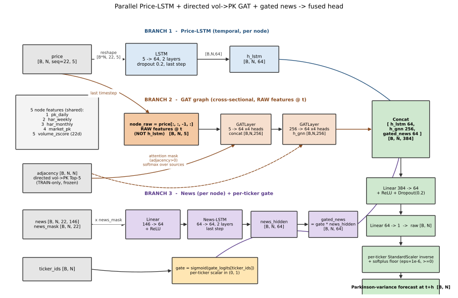
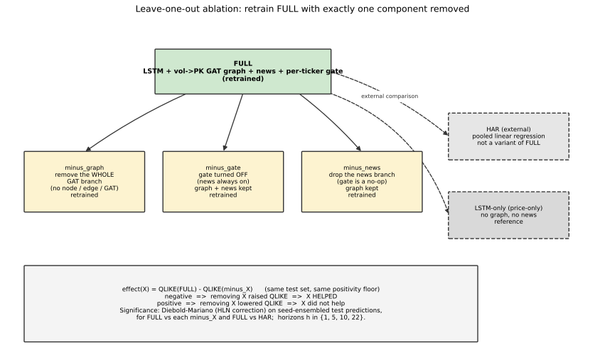

# Stock Volatility Prediction for the Vietnamese Stock Market

---

## Abstract

Volatility forecasts set risk limits, margin, and option prices across the Vietnamese stock market. This
work targets volatility forecasting for Vietnamese equities in general and uses the VN30 constituents
(the most liquid stocks on Vietnam's Ho Chi Minh Stock Exchange) as the empirical case study. Two
structural signals a univariate Heterogeneous AutoRegressive (HAR) model discards are Vietnamese-language
news and cross-stock spillover. We propose a parallel
multi-branch model that fuses three branches for one ticker's multi-horizon Parkinson-variance forecast: a
per-node price LSTM over five node features, a real multi-head Graph Attention Network (GAT) over a
**directed volume-to-volatility (vol→PK) lead-lag edge**, and a PhoBERT news LSTM with a per-ticker
gate. The GAT branch consumes the raw node-feature vector at the forecast origin rather than the LSTM
hidden state, which matches the edge semantics (a source ticker's volume shock at $t$ leading a target
ticker's volatility at $t{+}1$) and keeps the graph branch an independent cross-sectional view for a
fair ablation. We evaluate the model with an **ablation**: from the full model we retrain
one variant per removed component (minus-graph removes the entire GAT branch, minus-gate removes the
per-ticker gate, minus-news removes the news branch), and we measure each component's contribution as
$\text{effect}(X)=\text{QLIKE}(\text{FULL})-\text{QLIKE}(\text{FULL}{-}X)$ on the held-out test set,
with a Diebold-Mariano test for significance. The classical HAR is the reference baseline. Across three seeds and four horizons the differences among
HAR, the full model, and the ablation variants are small on every metric. On MSE, RMSE, and $R^2$ the
configuration means lie within about 1% of one another and the best mean alternates across horizons; on
MAE the differences are similarly small and the lowest mean varies by horizon. On QLIKE, HAR has the
lowest mean at h5, h10, and h22 and the price-only LSTM backbone the lowest at h1. A Diebold-Mariano test
on the seed-ensembled predictions finds no significant QLIKE difference between the full model and HAR at
h1, h5, and h10 (DM $p=0.46/0.74/0.20$) and a significantly higher QLIKE for the full model at h22
($p<0.001$); the price-only LSTM backbone has significantly lower or equal QLIKE relative to the full
model at h1, h5, and h22. The ablation removals show mixed, mostly short-horizon QLIKE effects: removing
the GAT branch significantly lowers QLIKE at h1 and h22 with no significant difference at h5 or h10,
removing the per-ticker gate significantly lowers QLIKE at h1 only, and removing the news branch
significantly lowers QLIKE at h1 and h5 and raises it at h22. Across all five metrics no configuration
consistently or significantly outperforms HAR. A Mincer-Zarnowitz regression of realized on forecast variance gives near-zero intercepts and
slopes above one at every horizon (slope rising from about 1.04–1.06 at h1 to 1.13–1.18 at h22), and
the joint efficiency hypothesis ($a=0$, $b=1$) is rejected for every configuration ($p<0.001$). This
paper's contribution
is a leakage-safe ablation-based
attribution of a directed-spillover graph-attention news model against a strong HAR baseline on sparse
daily VN30 data.

**Keywords:** volatility forecasting; graph attention networks; directed spillover; financial news;
PhoBERT; emerging markets.

---

## 1. Introduction

Volatility forecasts drive the daily risk decisions of every desk that trades Vietnamese equities. This
work addresses stock-volatility forecasting for the Vietnamese market in general; the VN30 basket (the
roughly thirty most liquid stocks on Vietnam's Ho Chi Minh Stock Exchange) is the empirical case study
used for all experiments because it has the longest and cleanest daily histories. A margin engine sizes
collateral from forecast volatility, an option desk prices from it, and a risk officer sets position
limits against it. VN30 desks make these decisions inside an information environment that a price-only
forecaster discards: a steady flow of Vietnamese-language news that plausibly signals volatility shocks
before they reach the price range, and a web of cross-stock spillovers that a univariate model cannot
represent.

The classical HAR model of Corsi [1], the linear univariate workhorse that regresses future volatility
on its own daily, weekly, and monthly averages, admits neither signal, and it is hard to beat [14]. Two
structural extensions could close the gap: a news channel that reads text, and a cross-stock graph that
lets one stock's information reach another. Prior work on this project established, through a
leakage-safe exploratory analysis, that adding cross-sectional node features (a market factor and a
volume z-score) beats HAR on QLIKE, but that a *correlation-based* cross-stock edge adds no reliable
out-of-sample value because a single market factor dominates cross-stock volatility co-movement. This
motivates the present study's central design choice: rather than a symmetric correlation edge, we test a
**directed, lead-lag volume→volatility edge** — a source ticker's abnormal volume today linked to a
target ticker's range volatility tomorrow — which encodes a predictive, causal-direction relationship
that a contemporaneous correlation edge cannot.

We build this edge into a parallel multi-branch architecture (an LSTM temporal branch, a GAT graph
branch, and a gated news branch, concatenated at a shared head) and we quantify, per component and per
horizon, the marginal contribution of each part with an **ablation**: we build the
full model, then retrain a variant with exactly one component removed, and attribute each component's
contribution as the change in held-out QLIKE it causes. This paper makes three contributions.

1. **A directed vol→PK graph-attention news model on a parallel multi-branch backbone.** The model fuses a
   per-node price LSTM, a real multi-head GAT over a directed volume-to-volatility lead-lag edge, and a
   gated PhoBERT news branch. The GAT consumes the raw node-feature vector at the forecast origin, which
   matches the edge semantics and keeps the graph branch an independent cross-sectional view (Section 4).

2. **An ablation against a strong HAR baseline.** From the full model we retrain one
   variant per removed component — minus-graph (the whole GAT branch), minus-gate, minus-news — so every
   effect is measured on the same footing, and we report each component's marginal contribution
   $\text{effect}(X)=\text{QLIKE}(\text{FULL})-\text{QLIKE}(\text{FULL}{-}X)$ with a Diebold-Mariano test
   (Section 6).

3. **A leakage-safe multi-horizon evaluation.** All models are evaluated at horizons 1, 5, 10, and 22
   trading days on a chronological split with train-only scalers and a train-only frozen edge, with the
   held-out test set as the reported result, over three seeds with seed-ensembled significance tests
   (Sections 5 and 6).

---

## 2. Related Work

We group prior work into four families and state where the proposed model sits relative to each.

**Econometric volatility models.** The HAR model [1] and its range-based inputs [2] set the standard for
daily volatility forecasting and remain hard to beat. HAR regresses future volatility on daily, weekly,
and monthly moving averages, approximating volatility's long memory with a parsimonious linear fit. The
HARQ extension [15] shrinks the daily coefficient when the volatility estimate is noisy. A large-scale
controlled study finds that tuned machine-learning models fail to beat a carefully re-estimated HAR on
QLIKE and MSE when both use the same information set [14]. These models are univariate and linear: no
channel admits text, and no channel couples one stock to another. We keep the three HAR scales among the
node features and add the news and directed cross-stock channels HAR omits; classical HAR is the baseline
every component must beat.

**Deep and graph-based forecasters.** LSTM forecasters [4] capture nonlinear temporal structure, and
graph attention networks [5] model cross-asset coupling; hybrid LSTM-GNN designs combine both [9]. Chen
and Robert [19] forecast multivariate realized volatility with a graph over about 500 S&P names. Most
relevant, Zhang, Pu, Cucuringu and Dong [10] build a graph-neural-network HAR (GNNHAR) on DJIA-30 and,
under a Model Confidence Set, find that multi-hop cross-stock graph spillover gives no clear advantage:
the gains come from modeling nonlinearity and from switching the training loss from MSE to QLIKE. Their
controlled null on the graph component motivates our shift from a symmetric correlation edge to a
directed lead-lag edge, tested here under an ablation.

**Directed spillover and lead-lag graphs.** A symmetric correlation edge conflates contemporaneous
co-movement (largely a market factor) with predictive structure. Directed spillover measures — for
example volatility spillover indices [16] — encode who-leads-whom and are asymmetric by construction. We
instantiate a directed edge from a source ticker's abnormal volume to a target ticker's next-day range
volatility, motivated by the volume–volatility lead-lag relation, and freeze it on the training window.

**News- and text-augmented forecasting.** Text-augmented forecasters add sentiment scores or news
embeddings [7,8], usually fusing a single market-wide signal by concatenation on English- or
Chinese-language markets. We work in Vietnamese with PhoBERT [3] on VN30 and add a per-ticker gate that
admits a different amount of news per stock.

---

## 3. Data

**Universe (case study).** The method targets the Vietnamese stock market in general; VN30 is the
case-study universe for the experiments. We use 33 VN30 constituents with daily
open-high-low-close-volume (OHLCV) data. Series
lengths range from about 1,300 sessions (SSB, listed 2021) to about 4,900 (VNM, ACB, from 2006). We
exclude two current VN30 members (BSR, VPL) whose listing histories are too short to align with the
panel. The universe is therefore a fixed, point-in-time VN30-like set rather than the live index, a
limitation stated in Section 8.

**Forecast target.** We forecast the daily Parkinson range volatility at horizons 1, 5, 10, and 22
trading days ahead: the target is the single-day estimator value on day $t{+}h$ (i.e.
$\text{PK}(t{+}h)$), not an average over the next $h$ days. The Parkinson estimator uses the intraday high $H$
and low $L$:

$$\sigma^2_{\text{Park}} = \frac{(\ln(H/L))^2}{4\ln 2}.$$

The processed `parkinson_volatility` column is numerically the Parkinson **variance** estimator
($\sigma^2$, non-negative), and every model in this paper forecasts this same daily realized-variance
quantity.

**Node features.** Each ticker-day carries five node features in a fixed order, all with unified
22-trading-day windows to match the monthly HAR scale:

1. `pk_daily` — the Parkinson variance at $t$, clipped to $\pm 3\sigma$ using train statistics.
2. `har_weekly` — trailing 5-day mean of `pk_daily`.
3. `har_monthly` — trailing 22-day mean of `pk_daily`.
4. `market_pk` — cross-sectional median of $\sqrt{\text{PK}}$ across present tickers at $t$ (a
   contemporaneous market factor; uses column $t$ only).
5. `volume_zscore` — trailing rolling-22 z-score of $\log(1+\text{volume})$; tickers with no OHLCV
   volume series receive a neutral 0.0.

**News panel.** Each Vietnamese article (title and lead) passes once through PhoBERT [3], yielding a
768-dimensional embedding reduced by PCA (fit before the training cutoff) to a per-day per-stock vector
of 146 dimensions (embedding components, per-group norms, exponentially weighted averages with a
30-trading-day half-life, and topic counts). Missing news on a day is a zero vector with a mask bit set
to zero, and an all-missing window still produces a finite representation.

**Directed vol→PK edge.** The adjacency is directed: for each target ticker $j$ we connect the Top-5
source tickers $i$ ranked by the train-only lead-lag correlation
$\text{corr}(\text{volume\_shock}_i(t),\ \sqrt{\text{PK}_j}(t{+}1))$. Edges are estimated on training
rows only and frozen for validation and test (leakage-safe), and self-loops are kept on the diagonal.

**Temporal split and leakage control.** Each ticker's series is split chronologically into 70% train,
15% validation, and 15% test before generating features, fitting scalers, or building windows; the
earliest series begin in 2006. The split is applied per ticker on its own timeline, so the
train/validation/test calendar boundaries differ across tickers — a ticker listed in 2021 has later
boundaries than one trading since 2006 — which is precisely why a fixed-node synchronized panel would
collapse and why the pooled per-ticker split is used. Per-ticker
price and target scalers are fit on the training partition only and selected at evaluation by explicit
`ticker_id`. A news feature for a sample uses only information available by that sample's forecast
origin. Evaluation reads stored raw targets rather than inverse-transforming a clipped normalized target.
On the pooled masked manifest the evaluation sets hold, at the five-day horizon, 14,418 validation and
14,464 present-node test observations, shared identically across every rung; the counts vary slightly by
horizon (e.g. 14,550/14,596 at h1 and 14,253/14,299 at h10) because the target shift changes the number
of eligible windows.

---

## 4. Method

We describe the proposed full model first, then define the ablation variants as component removals
from it. The model forecasts one ticker's $h$-day-ahead Parkinson variance from four inputs: a 22-day
price window of the five node features, a 22-day news window of PhoBERT features with a mask, the ticker
identity, and the directed vol→PK adjacency over the tickers present on the same date.

**The proposed full model.** Three branches run in parallel and concatenate at a shared head.

- **(i) Price-LSTM branch (temporal, per node).** A two-layer LSTM (hidden size 64, dropout 0.2) reads
  each ticker's 22-day window of the five node features into a price representation $h_{\text{lstm}}$
  ($\mathbb{R}^{64}$ per node).

- **(ii) GAT graph branch (cross-sectional).** The node input is the **raw** node-feature vector at the
  last timestep, $\text{node\_raw}=\text{price}[:, :, {-}1, :]\in\mathbb{R}^{5}$, not the LSTM hidden
  state. Two self-written multi-head GAT layers (5→256, then 256→256; 4 heads) with attention masked by
  the adjacency ($\text{softmax}$ over source nodes, ELU output) produce $h_{\text{gnn}}\in\mathbb{R}^{256}$.
  Consuming the raw features matches the edge semantics (`volume_shock` is directly available to the
  attention) and keeps the graph branch independent of the LSTM branch, so removing it is a clean
  ablation. When the graph is switched off, the adjacency is the identity (self-loops only).

- **(iii) News branch with per-ticker gate.** The 146-dimensional daily news vector passes through a
  linear-plus-ReLU projection into a two-layer LSTM (hidden size 64) over the masked window, producing a
  news representation, scaled by a learned per-ticker sigmoid gate
  $\text{news}^{\text{gated}}_i = \sigma(g_i)\cdot\text{news}_i$.

The head concatenates $[h_{\text{lstm}}(64),\ h_{\text{gnn}}(256),\ \text{news}^{\text{gated}}(64)]$
($\mathbb{R}^{384}$) and maps it through a linear-ReLU-dropout-linear stack to the forecast. A softplus
**positivity floor** ($\varepsilon=10^{-6}$, applied in the denormalized space and identical across all
compared rungs) clamps predictions away from non-positive variance before QLIKE.

**The ablation variants.** We build the full model, then retrain one variant per removed component,
so every effect is measured on the same footing (each variant trains in the same graph on/off regime it
is evaluated in — no train/eval mismatch):

- **FULL** — LSTM + directed vol→PK GAT graph + news + per-ticker gate.
- **minus_graph** — FULL with the **entire GAT branch removed** (no node/edge/GAT built; the head takes
  $[h_{\text{lstm}},\ \text{news}^{\text{gated}}]\in\mathbb{R}^{128}$). This isolates the whole graph
  subsystem, not merely the edges.
- **minus_gate** — FULL without the per-ticker gate.
- **minus_news** — FULL without the news branch (the gate is a no-op without news).
- **HAR** — a pooled per-ticker HAR linear regression on the three HAR scales; the floor every
  component must beat.

The contribution of component $X$ is $\text{effect}(X)=\text{QLIKE}(\text{FULL})-\text{QLIKE}(\text{FULL}{-}X)$
on the held-out test set; a negative value means removing $X$ raised QLIKE, i.e. $X$ helped.

**Training.** The deep models use Adam (learning rate $10^{-3}$), weight decay $10^{-5}$, dropout 0.2,
and gradient clipping at 1.0, with best-validation-checkpoint selection. Because pooled models converge
within a few epochs and then overfit, training uses early stopping (patience 3, minimum 6 epochs) under
a 12-epoch cap. Every configuration is trained under three seeds (42, 123, 2026); test metrics are
reported as mean(std) over the three seeds, and Diebold-Mariano tests run on the seed-ensembled test
predictions.

---

## 5. Experimental Setup

**Metrics.** Every configuration reports five metrics on the raw variance scale: MSE, RMSE, MAE, $R^2$,
and QLIKE. QLIKE, the quasi-likelihood loss standard in the realized-volatility literature [patton],
penalizes under-prediction more than over-prediction and tolerates the noise in the volatility proxy:

$$\text{QLIKE} = \frac{1}{T}\sum_{t=1}^{T}\left(\frac{\hat{\sigma}^2_t}{\sigma^2_t} - \ln\frac{\hat{\sigma}^2_t}{\sigma^2_t} - 1\right).$$

Directional accuracy is not reported.

**Training objective.** All deep configurations minimize the mean squared error between the model output
and the per-ticker normalized target; QLIKE and the other metrics are computed only at evaluation, after
inverting the normalization to the raw variance scale, so the proportional QLIKE loss never enters the
gradient.

**Reporting protocol.** Model selection (early-stopping, best-checkpoint) uses the validation split only;
all reported results and significance tests are computed on the held-out test set; validation is used
only for model selection, and no validation metrics are reported.

**Significance.** We complement metric comparisons with a Diebold-Mariano (DM) test on the
per-observation QLIKE (and squared-error) loss series (HAC truncation lag $h{-}1$,
Harvey-Leybourne-Newbold corrected), which tests forecast-accuracy equality directly on the held-out
observations. The DM test runs on the seed-ensembled predictions (the per-observation mean forecast over
seeds 42, 123, 2026).

**Implementation and compute.** All models are implemented in PyTorch (self-written GAT layer; no
external graph library) and use a CUDA GPU. Runs used an NVIDIA GeForce RTX 4060 Laptop GPU under PyTorch
2.6 with CUDA 12.4.

---

## 6. Results

### 6.1 Held-out test metrics across horizons

**Table 1. Held-out TEST metrics by horizon, mean(std) over three seeds (42, 123, 2026).** Lower is
better for MSE, RMSE, MAE, QLIKE; higher for $R^2$. Bold marks the best mean per column within each
horizon; the same test observations are shared across all rows of a horizon. HAR is a deterministic
linear regression (std 0.00). Source: three-seed `ladder_metrics.json` and `lstm_only_metrics.json`
(`*.test_metrics`).

*h = 1 trading day*

| Config | MSE (×10⁻⁶) ↓ | RMSE (×10⁻³) ↓ | MAE (×10⁻⁴) ↓ | $R^2$ ↑ | QLIKE ↓ |
|---|---|---|---|---|---|
| HAR | 4.05 (0.00) | 2.014 (0.000) | 5.41 (0.00) | 0.8192 (0.0000) | 0.4813 (0.0000) |
| FULL | 4.06 (0.08) | 2.015 (0.020) | 5.45 (0.07) | 0.8189 (0.0036) | 0.4853 (0.0059) |
| minus_graph | 4.04 (0.05) | 2.009 (0.012) | 5.41 (0.05) | 0.8200 (0.0022) | 0.4797 (0.0045) |
| minus_gate | 4.02 (0.10) | 2.006 (0.025) | 5.42 (0.06) | 0.8206 (0.0045) | 0.4830 (0.0070) |
| minus_news | **4.01 (0.08)** | **2.003 (0.021)** | 5.42 (0.06) | **0.8210 (0.0037)** | 0.4824 (0.0071) |
| LSTM-only | 4.08 (0.09) | 2.021 (0.022) | **5.36 (0.05)** | 0.8179 (0.0040) | **0.4791 (0.0051)** |

*h = 5 trading days*

| Config | MSE (×10⁻⁶) ↓ | RMSE (×10⁻³) ↓ | MAE (×10⁻⁴) ↓ | $R^2$ ↑ | QLIKE ↓ |
|---|---|---|---|---|---|
| HAR | 5.23 (0.00) | 2.287 (0.000) | 6.05 (0.00) | 0.7672 (0.0000) | **0.5735 (0.0000)** |
| FULL | 5.19 (0.08) | 2.278 (0.018) | **5.97 (0.05)** | 0.7691 (0.0036) | 0.5768 (0.0033) |
| minus_graph | 5.19 (0.05) | 2.278 (0.011) | **5.97 (0.06)** | 0.7691 (0.0022) | 0.5781 (0.0064) |
| minus_gate | **5.18 (0.05)** | 2.277 (0.012) | **5.97 (0.04)** | 0.7693 (0.0024) | 0.5757 (0.0015) |
| minus_news | 5.21 (0.09) | 2.282 (0.019) | **5.97 (0.06)** | 0.7682 (0.0038) | 0.5759 (0.0031) |
| LSTM-only | **5.18 (0.05)** | **2.275 (0.012)** | 5.98 (0.07) | **0.7696 (0.0024)** | 0.5772 (0.0056) |

*h = 10 trading days*

| Config | MSE (×10⁻⁶) ↓ | RMSE (×10⁻³) ↓ | MAE (×10⁻⁴) ↓ | $R^2$ ↑ | QLIKE ↓ |
|---|---|---|---|---|---|
| HAR | 5.56 (0.00) | 2.358 (0.000) | 6.30 (0.00) | 0.7532 (0.0000) | **0.6139 (0.0000)** |
| FULL | 5.56 (0.12) | 2.357 (0.026) | **6.29 (0.10)** | 0.7534 (0.0054) | 0.6441 (0.0342) |
| minus_graph | 5.50 (0.08) | 2.345 (0.017) | 6.35 (0.03) | 0.7560 (0.0035) | 0.6179 (0.0033) |
| minus_gate | **5.49 (0.03)** | 2.344 (0.006) | 6.34 (0.10) | 0.7562 (0.0012) | 0.6225 (0.0033) |
| minus_news | 5.55 (0.12) | 2.356 (0.025) | 6.31 (0.14) | 0.7535 (0.0053) | 0.6595 (0.0533) |
| LSTM-only | **5.49 (0.05)** | **2.342 (0.011)** | 6.33 (0.04) | **0.7566 (0.0023)** | 0.6189 (0.0043) |

*h = 22 trading days*

| Config | MSE (×10⁻⁶) ↓ | RMSE (×10⁻³) ↓ | MAE (×10⁻⁴) ↓ | $R^2$ ↑ | QLIKE ↓ |
|---|---|---|---|---|---|
| HAR | **6.02 (0.00)** | **2.453 (0.000)** | 6.56 (0.00) | **0.7303 (0.0000)** | **0.6742 (0.0000)** |
| FULL | 6.11 (0.03) | 2.472 (0.006) | 6.54 (0.07) | 0.7262 (0.0014) | 0.7053 (0.0066) |
| minus_graph | 6.15 (0.14) | 2.479 (0.028) | **6.53 (0.02)** | 0.7245 (0.0062) | 0.6956 (0.0140) |
| minus_gate | 6.22 (0.18) | 2.493 (0.037) | 6.62 (0.05) | 0.7214 (0.0082) | 0.7058 (0.0079) |
| minus_news | 6.19 (0.09) | 2.489 (0.018) | 6.60 (0.01) | 0.7225 (0.0041) | 0.7097 (0.0107) |
| LSTM-only | 6.09 (0.02) | 2.468 (0.004) | 6.54 (0.05) | 0.7271 (0.0009) | 0.7003 (0.0067) |

Reading across horizons: on the squared-error metrics (MSE, RMSE, $R^2$) the configuration means fall
within about 1% of one another and the best row alternates (minus_news at h1, minus_gate/LSTM-only at
h5/h10, HAR at h22); on MAE the differences are similarly small and the lowest mean varies by horizon
(LSTM-only at h1, four configurations tied near 5.97 at h5, FULL at h10, minus_graph at h22); on QLIKE,
HAR has the lowest mean at h5, h10, and h22 while the price-only LSTM-only has the lowest mean at h1. The
reported standard deviations are small relative to the between-configuration gaps except at h10, where the
FULL and minus_news QLIKE means carry larger seed dispersion (std 0.034 and 0.053). The remaining
subsections isolate each component (Section 6.2), compare FULL against HAR (Section 6.3), test
significance (Section 6.4), and evaluate forecast calibration (Section 6.5).

### 6.2 Component contributions across horizons

**Table 2. Component contribution on held-out test QLIKE, $\text{effect}(X)=\text{QLIKE}(\text{FULL})-\text{QLIKE}(\text{FULL}{-}X)$, three-seed mean.**
Negative = removing $X$ raised QLIKE, i.e. $X$ helped. Source: three-seed `ladder_metrics.json`
(`leave_one_out_effects`).

| Horizon | effect(graph) | effect(gate) | effect(news) |
|---|---|---|---|
| 1 | $+0.00566$ | $+0.00235$ | $+0.00297$ |
| 5 | $-0.00130$ | $+0.00105$ | $+0.00088$ |
| 10 | $+0.02617$ | $+0.02159$ | $-0.01541$ |
| 22 | $+0.00979$ | $-0.00041$ | $-0.00432$ |

Reading: `effect(graph)` is positive at h1, h10, and h22 (removing the GAT branch lowers QLIKE there) and
marginally negative at h5 ($-0.0013$). `effect(gate)` is positive at h1, h5, and h10 and marginally
negative at h22 ($-0.0004$). `effect(news)` is positive at h1 and h5 and negative at h10 ($-0.0154$) and
h22 ($-0.0043$), so removing the news branch raises QLIKE only at the longer horizons. These are QLIKE
effects; the corresponding MSE, RMSE, and $R^2$ differences among the same configurations are within about
1% (Table 1). The magnitudes at h10 are the largest, but the seed dispersion at h10 (Table 1) is also the
largest; the Diebold-Mariano test (Section 6.4) determines which differences are significant on the
seed-ensembled predictions.

### 6.3 FULL versus HAR across horizons

**Table 3. FULL vs HAR, held-out test, all four horizons, mean(std) over three seeds.** Columns pair
each metric HAR-then-FULL; bold marks the better mean of the pair. Source: three-seed
`ladder_metrics.json` (`rungs.FULL.test_metrics`, `rungs.HAR.test_metrics`).

| Horizon | HAR QLIKE | FULL QLIKE | HAR $R^2$ | FULL $R^2$ | HAR RMSE (×10⁻³) | FULL RMSE (×10⁻³) |
|---|---|---|---|---|---|---|
| 1 | **0.4813 (0.0000)** | 0.4853 (0.0059) | **0.8192 (0.0000)** | 0.8189 (0.0036) | **2.014 (0.000)** | 2.015 (0.020) |
| 5 | **0.5735 (0.0000)** | 0.5768 (0.0033) | 0.7672 (0.0000) | **0.7691 (0.0036)** | 2.287 (0.000) | **2.278 (0.018)** |
| 10 | **0.6139 (0.0000)** | 0.6441 (0.0342) | 0.7532 (0.0000) | **0.7534 (0.0054)** | 2.358 (0.000) | **2.357 (0.026)** |
| 22 | **0.6742 (0.0000)** | 0.7053 (0.0066) | **0.7303 (0.0000)** | 0.7262 (0.0014) | **2.453 (0.000)** | 2.472 (0.006) |

Reading: on RMSE and $R^2$ the full model and HAR are within their seed dispersion at h1, h5, and h10,
and HAR is marginally ahead at h22 (MSE and MAE follow the same pattern in Table 1). On QLIKE, HAR has
the lower mean at all four horizons, with the gap widening from h1 (0.0040) to h22 (0.0311). The
Diebold-Mariano table (Table 4) tests the QLIKE gaps on the seed-ensembled predictions: the full model
shows no significant difference from HAR at h1, h5, and h10, and HAR has significantly lower QLIKE than
the full model at h22.

### 6.4 Diebold-Mariano significance

**Table 4. Diebold-Mariano (HLN) on held-out test QLIKE, seed-ensembled (42, 123, 2026), per horizon.**
Each cell is the HLN-corrected DM statistic with its two-sided $p$-value; a **negative** statistic means
FULL has the lower (better) QLIKE, a **positive** statistic means the comparator is better. HAC
truncation lag $h{-}1$; $n$ per horizon is 14,596 (h1), 14,464 (h5), 14,299 (h10), 13,903 (h22)
present-node test observations. Source: `dm_report.py` over the seed-ensembled per-rung
`predictions_test.json` dumps.

| Comparison | h1 | h5 | h10 | h22 |
|---|---|---|---|---|
| FULL vs HAR | $+0.732$ (p .46) | $-0.337$ (p .74) | $+1.279$ (p .20) | $+5.104$ (p<.001) |
| FULL vs minus_graph | $+8.697$ (p<.001) | $+1.291$ (p .20) | $+0.799$ (p .42) | $+5.883$ (p<.001) |
| FULL vs minus_gate | $+6.781$ (p<.001) | $+0.935$ (p .35) | $+0.076$ (p .94) | $+1.562$ (p .12) |
| FULL vs minus_news | $+8.045$ (p<.001) | $+4.455$ (p<.001) | $+1.098$ (p .27) | $-3.142$ (p .0017) |
| FULL vs LSTM-only | $+6.074$ (p<.001) | $+2.578$ (p .0099) | $+0.559$ (p .58) | $+2.231$ (p .026) |

Reading: FULL vs HAR is not significant at h1, h5, and h10 ($p=0.46/0.74/0.20$) and is positive and
significant at h22 ($+5.104$, $p<0.001$), so HAR has significantly lower QLIKE at h22 and there is no
significant difference at the shorter horizons. FULL vs minus_graph is positive and significant at h1 and
h22 ($p<0.001$) and not significant at h5 and h10, so removing the GAT branch significantly lowers QLIKE
at h1 and h22 and shows no significant difference at h5/h10. FULL vs minus_gate is positive and
significant at h1 ($+6.781$, $p<0.001$) and not significant at h5, h10, or h22, so removing the gate
significantly lowers QLIKE only at h1. FULL vs minus_news is positive and significant at h1 and h5
($p<0.001$), not significant at h10, and negative and significant at h22 ($-3.142$, $p=0.0017$), so
removing the news branch lowers QLIKE at h1 and h5 and raises it at h22. FULL vs LSTM-only is positive
and significant at h1, h5, and h22 and not significant at h10, so the price-only LSTM backbone has
significantly lower or equal QLIKE relative to the full model at those horizons.

### 6.5 Mincer-Zarnowitz forecast efficiency

The Diebold-Mariano tests compare forecast *accuracy*; the Mincer-Zarnowitz (MZ) regression evaluates
forecast *calibration/bias*, a complementary property. For each rung and horizon we regress the realized
variance $y$ on the seed-ensembled forecast $x$,

$$y = a + b\,x + e,$$

and test the joint efficiency hypothesis $H_0: a=0 \text{ and } b=1$ with a Wald statistic
$W=(\hat\theta-\theta_0)'V^{-1}(\hat\theta-\theta_0)$ ($\hat\theta=(a,b)$, $\theta_0=(0,1)$,
$V=\hat\sigma^2(X'X)^{-1}$), which is $\chi^2_2$ under $H_0$. A well-calibrated forecast has an intercept
near zero, a slope near one, and a large joint $p$-value; a slope above one indicates the forecast
under-responds to realized variance (an attenuation bias), and a slope below one indicates the opposite.

**Table 5. Mincer-Zarnowitz regression of realized on forecast variance, seed-ensembled (42, 123, 2026),
per horizon.** Intercept $a$ in $\times10^{-6}$ (target scale $\approx10^{-4}$), slope $b$, regression
$R^2$, and the joint Wald statistic with its $\chi^2_2$ $p$-value ($H_0: a=0, b=1$). Bold marks, per
horizon and per column, the value closest to calibration (smallest $|a|$, slope closest to 1, highest
$R^2$, smallest Wald). $n$ per horizon is 14,596 (h1), 14,464 (h5), 14,299 (h10), 13,903 (h22). Source:
`mz_report.py` over the seed-ensembled per-rung `predictions_test.json` dumps.

*h = 1 trading day*

| Rung | $a$ (×10⁻⁶) | $b$ | $R^2$ | Wald | joint $p$ |
|---|---|---|---|---|---|
| HAR | $-13.95$ | 1.0611 | 0.8220 | 234.6 | <0.001 |
| FULL | $-14.69$ | 1.0461 | 0.8226 | 136.9 | <0.001 |
| minus_graph | $-6.50$ | **1.0410** | 0.8220 | **110.5** | <0.001 |
| minus_gate | $-12.91$ | 1.0522 | 0.8241 | 176.3 | <0.001 |
| minus_news | $-12.53$ | 1.0445 | **0.8244** | 129.7 | <0.001 |
| LSTM-only | **$+5.42$** | 1.0521 | 0.8210 | 179.2 | <0.001 |

*h = 5 trading days*

| Rung | $a$ (×10⁻⁶) | $b$ | $R^2$ | Wald | joint $p$ |
|---|---|---|---|---|---|
| HAR | $-10.58$ | 1.0793 | 0.7717 | 280.5 | <0.001 |
| FULL | **$+6.82$** | 1.0793 | **0.7744** | 293.1 | <0.001 |
| minus_graph | $+12.29$ | 1.0618 | 0.7730 | 185.0 | <0.001 |
| minus_gate | $+10.18$ | 1.0679 | 0.7734 | 219.9 | <0.001 |
| minus_news | $+11.46$ | 1.0693 | 0.7726 | 228.2 | <0.001 |
| LSTM-only | $+12.75$ | **1.0579** | 0.7732 | **164.3** | <0.001 |

*h = 10 trading days*

| Rung | $a$ (×10⁻⁶) | $b$ | $R^2$ | Wald | joint $p$ |
|---|---|---|---|---|---|
| HAR | $-13.81$ | 1.1009 | 0.7600 | 405.0 | <0.001 |
| FULL | $+10.77$ | 1.0809 | 0.7587 | 277.4 | <0.001 |
| minus_graph | $-14.51$ | 1.0791 | 0.7616 | 260.1 | <0.001 |
| minus_gate | $-7.98$ | **1.0754** | 0.7614 | **239.8** | <0.001 |
| minus_news | **$+7.46$** | 1.0779 | 0.7590 | 258.0 | <0.001 |
| LSTM-only | $-11.18$ | 1.0791 | **0.7619** | 261.8 | <0.001 |

*h = 22 trading days*

| Rung | $a$ (×10⁻⁶) | $b$ | $R^2$ | Wald | joint $p$ |
|---|---|---|---|---|---|
| HAR | $-29.24$ | 1.1388 | **0.7420** | 627.4 | <0.001 |
| FULL | $-15.96$ | 1.1610 | 0.7418 | 822.0 | <0.001 |
| minus_graph | $-3.41$ | 1.1462 | 0.7396 | 694.7 | <0.001 |
| minus_gate | $-15.93$ | 1.1474 | 0.7361 | 684.4 | <0.001 |
| minus_news | $-26.38$ | 1.1757 | 0.7409 | 944.4 | <0.001 |
| LSTM-only | **$-1.63$** | **1.1260** | 0.7386 | **531.9** | <0.001 |

Reading: the intercepts are near zero at every horizon (all $|a|\le 30\times10^{-6}$ against a target on
the $10^{-4}$ scale), so the level bias is small and the calibration gap is carried by the slope. Every
slope exceeds one and the departure from one increases with the horizon, from about $1.04$–$1.06$ at h1
to about $1.13$–$1.18$ at h22, indicating that the forecasts increasingly under-respond to realized
variance at longer horizons. The joint hypothesis $a=0, b=1$ is rejected for every rung at every horizon
($p<0.001$), consistent with the large sample size ($n\approx13{,}900$–$14{,}600$). By the Wald
magnitude, the configuration closest to MZ efficiency is minus_graph at h1, LSTM-only at h5 and h22, and
minus_gate at h10; no single configuration is closest to calibration across all four horizons. MZ
measures calibration/bias and is complementary to the QLIKE/MSE accuracy comparisons in Sections 6.1–6.4.

---

## 7. Discussion

**What each component contributes.** Table 2 reports each component's marginal QLIKE contribution, and
Table 4 its significance on the seed-ensembled predictions; on the MSE, RMSE, and $R^2$ metrics the same
configurations differ by about 1% or less (Table 1). For the GAT branch, removing it significantly lowers
QLIKE at h1 and h22 ($p<0.001$) with no significant difference at h5 or h10, so the directed lead-lag edge
— the design chosen specifically to avoid the market-factor redundancy of a correlation edge — yields no
significant out-of-sample QLIKE improvement at any horizon. This is consistent with the earlier
correlation-edge finding: redirecting the edge to a predictive volume→volatility relation and giving the
attention raw features does not produce a QLIKE improvement. For the news branch, removing it
significantly lowers QLIKE at h1 and h5 and significantly raises it at h22 ($p=0.0017$), so the news
branch lowers QLIKE only at h22. For the gate, removing it significantly lowers QLIKE at h1 and shows no
significant difference at the other horizons. Relative to HAR, the full model shows no significant QLIKE
difference at h1, h5, and h10 and has significantly higher QLIKE at h22 (Table 4).

**The price-only backbone relative to the full stack.** The LSTM-only reference (a shared pooled price
LSTM with no news, no gate, no graph) has three-seed test QLIKE 0.4791 / 0.5772 / 0.6189 / 0.7003 at
h1 / h5 / h10 / h22, and the seed-ensembled DM test finds it has significantly lower or equal QLIKE
relative to the full model at h1, h5, and h22 (no significant difference at h10). Relative to HAR, both
LSTM-only and the full model show no significant QLIKE advantage at h1–h10 and higher QLIKE than HAR at
h22, so the deep temporal model matches HAR at the short horizons and does not overtake the linear
baseline at the long horizon.

**Forecast calibration.** The Mincer-Zarnowitz regression (Section 6.5) finds near-zero intercepts and
slopes above one at all four horizons, with the joint efficiency hypothesis rejected for every
configuration ($p<0.001$) and the slope departure from one growing with the horizon, and no single
configuration is closest to calibration across all four horizons.

**Overall reading.** Across three seeds and all five metrics, no configuration consistently or
significantly outperforms HAR. On MSE, RMSE, MAE, and $R^2$ the configurations differ by about 1% or
less, within seed dispersion, at every horizon; on QLIKE, HAR shows no significant difference from the
full model at h1, h5, and h10 and a significantly lower value at h22, and the price-only LSTM backbone
matches or has a significantly lower QLIKE than the full model at h1, h5, and h22. The graph, gate, and
news components do not provide a consistent significant improvement across horizons on any metric.

**Relation to the literature.** A null or negligible graph effect aligns with the best-controlled
published GNN-vs-HAR study, GNNHAR on DJIA-30, where multi-hop graph spillover gave no clear advantage
under a Model Confidence Set and the gains came from nonlinearity and a QLIKE training loss rather than
the graph [10], and with the broader finding that a well-specified HAR is hard to beat on a limited
information set [14].

**Levers not exercised here.** The literature identifies a QLIKE training objective and intraday-derived
realized variance as the decisive levers for beating HAR [10]; this study trains on MSE and forecasts a
daily range-based variance, so the ablation isolates architecture rather than objective or estimator.
These remain future work.

---

## 8. Limitations

First, the 33-ticker universe is a fixed, point-in-time VN30-like set that excludes two short-history
current members (BSR, VPL), so it is not the live index. Second, the study covers a single market at
daily frequency; the results may not transfer to higher frequencies or to markets with balanced listing
histories, and every rigorous published GNN-beats-HAR result relies on intraday-derived realized variance
this daily-OHLCV panel does not have. Third, the reported numbers aggregate three seeds (42, 123, 2026)
with seed-ensembled Diebold-Mariano tests; a five-seed extension and a Model Confidence Set are possible
future work to further tighten the significance estimates. Fourth, training uses an MSE objective rather
than the QLIKE objective the literature credits for closing the HAR gap.

---

## 9. Conclusion

We propose a parallel multi-branch model for multi-horizon VN30 Parkinson-variance forecasting that
fuses a price LSTM, a real multi-head GAT over a directed volume→volatility lead-lag edge, and a gated
PhoBERT news branch, with the GAT consuming raw node features to match the edge semantics. We evaluate it
with an ablation that retrains one variant per removed component and attributes each
component's contribution as the change it causes in held-out QLIKE, against a strong HAR baseline and
with seed-ensembled Diebold-Mariano significance, at horizons 1, 5, 10, and 22 trading days over three
seeds. Across all five metrics no configuration consistently or significantly outperforms HAR: on MSE,
RMSE, MAE, and $R^2$ the configurations differ by about 1% or less at every horizon, and on QLIKE the
full model shows no significant difference from HAR at h1, h5, and h10 and a significantly higher value at
h22. The ablation removals give mixed, mostly short-horizon QLIKE effects — removing the GAT branch
significantly lowers QLIKE at h1 and h22, removing the per-ticker gate at h1, and removing the news branch
at h1 and h5 while raising it at h22 — and a price-only LSTM backbone has significantly lower or equal
QLIKE relative to the full model at h1, h5, and h22. A Mincer-Zarnowitz regression finds near-zero
intercepts and slopes above one at every horizon, with the joint efficiency hypothesis rejected for every
configuration. For
a Vietnamese emerging market, the study shows how to build and honestly evaluate a directed-spillover
graph-attention news forecaster against the field-standard HAR.

---

## References

[1] Corsi, F. A simple approximate long-memory model of realized volatility. *Journal of Financial
Econometrics* 7(2), 174–196 (2009).

[2] Parkinson, M. The extreme value method for estimating the variance of the rate of return. *The
Journal of Business* 53(1), 61–65 (1980).

[3] Nguyen, D.Q., Nguyen, A.T. PhoBERT: Pre-trained language models for Vietnamese. In *Findings of
EMNLP 2020*, 1037–1042.

[patton] Patton, A.J. Volatility forecast comparison using imperfect volatility proxies. *Journal of
Econometrics* 160(1), 246–256 (2011).

[4] Hochreiter, S., Schmidhuber, J. Long short-term memory. *Neural Computation* 9(8), 1735–1780 (1997).

[5] Veličković, P., Cucurull, G., Casanova, A., Romero, A., Liò, P., Bengio, Y. Graph attention
networks. In *ICLR* (2018).

[7] Ouyang, Z.-S., Yang, X.-T., Lai, Y. Systemic financial risk early warning of financial market in
China using an Attention-LSTM model. *North American Journal of Economics and Finance* 56, 101383 (2021).

[8] Das, N., Sadhukhan, B., Chatterjee, R., Chakrabarti, S. Integrating sentiment analysis with graph
neural networks for enhanced stock prediction. *Decision Analytics Journal* 10, 100417 (2024).

[9] Sonani, M.S., Badii, A., Moin, A. Stock price prediction using a hybrid LSTM-GNN model. arXiv
preprint arXiv:2502.15813 (2025).

[10] Zhang, C., Pu, X., Cucuringu, M., Dong, X. Forecasting realized volatility with spillover effects:
perspectives from graph neural networks (GNNHAR). *International Journal of Forecasting* 41(1), 377–397
(2025). arXiv:2308.01419.

[11] Mincer, J., Zarnowitz, V. The evaluation of economic forecasts. In *Economic Forecasts and
Expectations: Analysis of Forecasting Behavior and Performance*, NBER, 3–46 (1969).

[14] Audrino, F., Chassot, J. HARd to beat: the overlooked impact of rolling windows in the era of
machine learning. *International Journal of Forecasting* (2025). arXiv:2406.08041.

[15] Bollerslev, T., Patton, A.J., Quaedvlieg, R. Exploiting the errors: a simple approach for improved
volatility forecasting (HARQ). *Journal of Econometrics* 192(1), 1–18 (2016).

[16] Diebold, F.X., Yilmaz, K. Better to give than to receive: predictive directional measurement of
volatility spillovers. *International Journal of Forecasting* 28(1), 57–66 (2012).

[19] Chen, Q., Robert, C.-Y. Multivariate realized volatility forecasting with graph neural network. In
*ACM ICAIF* (2022). arXiv:2112.09015.
